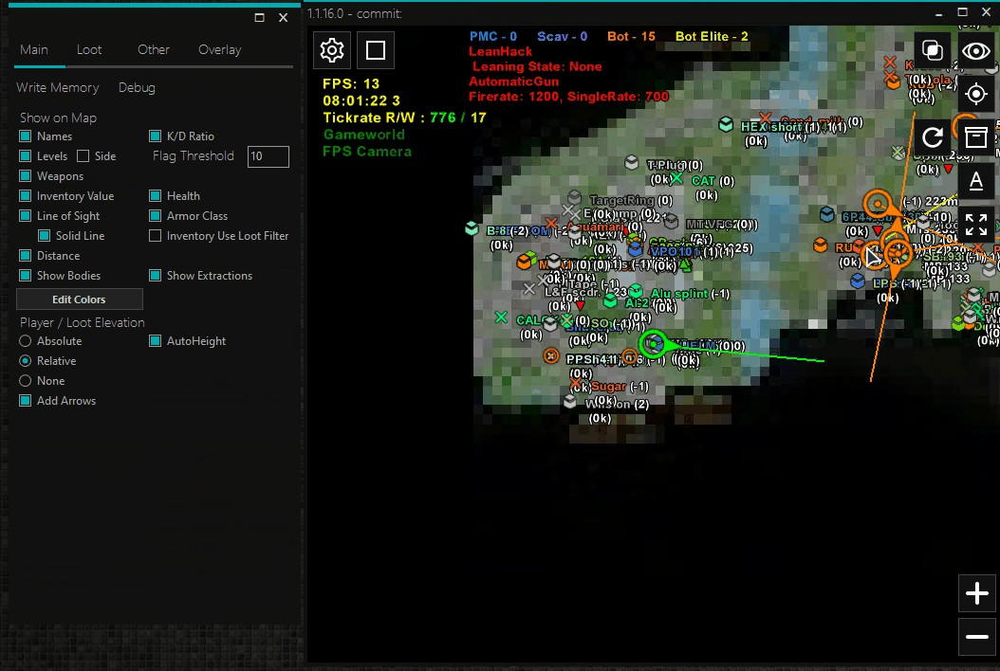

UP TO DATE! FEBRUARY 2024.

# 2D Radar

A simple OpenGL powered 2D radar for Escape From Tarkov backed by network socket communication.

## Demo

MP4:
https://i.imgur.com/LmVx30O.mp4

GIF:
https://i.imgur.com/LmVx30O.gif

## Features

### Players
- Names
- Levels
- Weapons
- Value of their inventory
- Line of Sight
- Distance meter
- Elevation meter
- K/D ratio
- Health
- Armor and Helmet class
- Various colors to set it all up

### Loot
- Search bar
- Categories
- Price filtering
- Priority filtering
- Live loot as well
- Tons of loot settings to be honest

### Write Memory Feature:
- No Recoil
- Pink Dudes
- Unlimited Stamina
- Aimbot
- Skill Hack
- No Weapon Overheat
- No Weapon Jam
- No Inertia
- No Visor
- Thermal Vision
- Night Vision
- Loot Through Walls
- Fly Hack
- Time Scale aka SpeedHack
- Always Allow Sprint

###  and many more...

## Run Locally

Open a winrar 
Extract 
Run a file "EFT-Shark"
BE CAREFUL - AFTER U DO THAT THEN ONLY OPEN EFT!
Enjoy

## Support

You may ask, I may answer.

## FAQ

#### Can I use that on Live servers?

Yes

#### Offsets up to date?

Pretty much.
